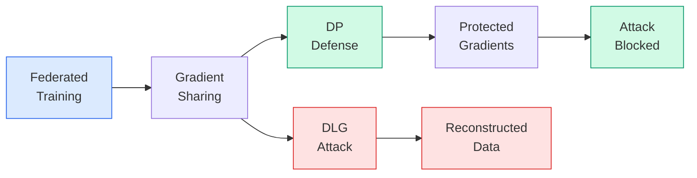

# Federated Learning + Privacy Attack Demo

[](https://github.com/YanissAmz/federated-learning-privacy/actions)


End-to-end demonstration of **federated learning** vulnerabilities and defenses: FedAvg training across multiple clients, **Deep Leakage from Gradients** (DLG) attack that reconstructs private training data from shared gradients, and **Differential Privacy** defense with configurable privacy budget --- all with an interactive Gradio interface.

---

## Pipeline



| Stage | What | Key metric |
|---|---|---|
| **FL Training** | FedAvg across N clients on CIFAR-10 | Global accuracy per round |
| **DLG Attack** | Reconstruct images from shared gradients | PSNR / SSIM of reconstruction |
| **DP Defense** | Gradient clipping + Gaussian noise | Privacy budget (epsilon) |
| **Trade-off** | Defense strength vs model accuracy | Accuracy drop at given epsilon |

---

## Quick start

```bash
git clone https://github.com/YanissAmz/federated-learning-privacy.git
cd federated-learning-privacy

# Install
uv venv && source .venv/bin/activate
uv pip install -e ".[dev]"

# Run tests
make test

# Launch Gradio demo
make demo
```

---

## Project structure

```
src/
  fl/               FedAvg server, client, data partitioning
  attacks/          DLG gradient reconstruction attack
  defenses/         Differential privacy (clipping + noise)
  demo/             Gradio interactive interface
configs/            YAML experiment configs
scripts/            CLI entrypoints (train, evaluate, demo)
tests/              Unit & integration tests
results/            Experiment outputs & visualizations
docs/               Technical writeup
```

---

## Deep Leakage from Gradients (DLG)

The DLG attack (Zhu et al., NeurIPS 2019) shows that shared gradients in federated learning can leak private training data:

1. Attacker receives gradients `dW` from a client
2. Initializes random dummy data and label
3. Optimizes dummy inputs to match the observed gradients via L-BFGS
4. Recovers near-pixel-perfect reconstructions of original training images

**This project demonstrates the attack visually**, then shows how differential privacy neutralizes it.

---

## Differential Privacy Defense

Defense mechanism with two components:

- **Gradient clipping**: bound per-sample gradient L2 norm to `C`
- **Gaussian noise**: add `N(0, sigma^2)` noise where `sigma = noise_multiplier * C`

The privacy guarantee follows from the Gaussian mechanism:

```
(epsilon, delta)-differential privacy  with  sigma >= sqrt(2 * ln(1.25 / delta)) / epsilon
```

---

## Results

> Experiments on CIFAR-10, 5 clients, 20 rounds. Full results in `results/`.

| | No defense | DP (eps=8) | DP (eps=1) |
|---|---|---|---|
| **FL accuracy** | -- | -- | -- |
| **DLG PSNR (dB)** | -- | -- | -- |
| **Attack success** | -- | -- | -- |

*Results will be filled after running experiments.*

---

## Limitations & future work

- DLG is demonstrated on single images; batch reconstruction is harder
- Non-IID data partitioning not yet evaluated
- No comparison with other defenses (secure aggregation, gradient compression)
- Planned: Flower integration, additional attack methods (iDLG, GradInversion)

---

## License

MIT
