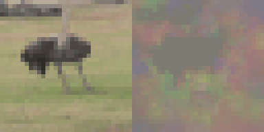
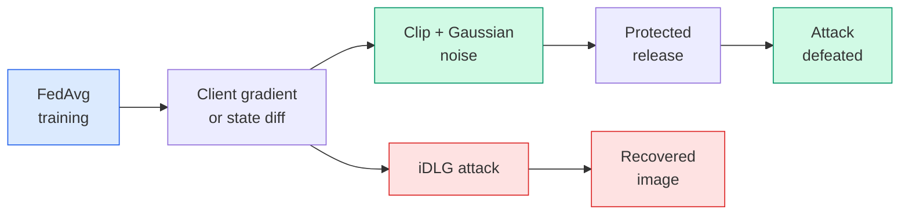
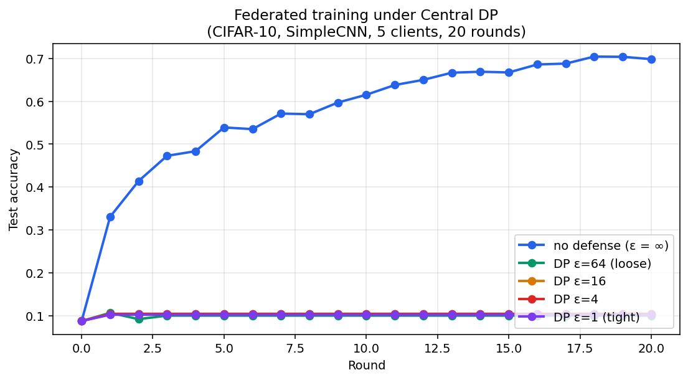
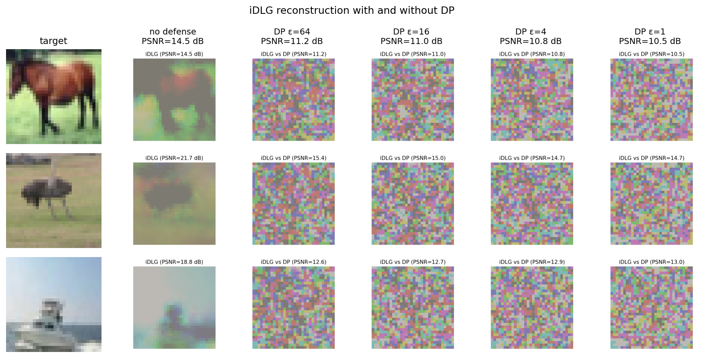

# Federated Learning + Privacy Attack Demo

[](https://github.com/YanissAmz/federated-learning-privacy/actions)


> Federated learning **isn't private by default**: shared gradients can be inverted to reconstruct individual training images. This repo shows the attack working, then shows differential privacy stopping it — at a measurable accuracy cost.

End-to-end implementation of FedAvg on CIFAR-10, the **iDLG** gradient-leakage attack (Zhao+ 2020 — improved over the original DLG with label inference), and **Central Differential Privacy** on FedAvg state-dict diffs (McMahan+ 2018). Reproducible benchmarks, an interactive Gradio demo, and a regression test that fails if the privacy claim ever breaks.


*A private CIFAR-10 image, reconstructed from one client's gradient in 300 L-BFGS iterations. Left: target. Right: attacker's reconstruction (fresh randomly-initialized model). PSNR ≈ 22 dB.*

---

## TL;DR

Three findings the experiments make visible:

1. **Plain FedAvg leaks.** From one client's gradient release on a fresh round-1 model, iDLG recovers the private CIFAR-10 input with a clearly visible reconstruction. The label is recovered exactly via the iDLG sign-pattern trick.
2. **DP at the gradient level defeats DLG.** Wrapping a single gradient release in clip + Gaussian noise destroys the reconstruction visually — the attacker fits noise. Demo tabs 2 and 3 make this side-by-side.
3. **Naive Central DP for *training* hits a hard ceiling on small federations.** Adding the same primitive to FedAvg state-dict diffs over 20 rounds with 5 clients on a ~1 M-param CNN collapses utility at any meaningful ε. This is the Gaussian-mechanism curse-of-dimensionality: noise norm grows with √D while the clipped signal stays at C. The curves below quantify it. Production systems route around it with **DP-SGD** (per-sample, smaller effective sensitivity) and **subsampling amplification** with hundreds-of-thousands of clients (Opacus, TF Privacy).

---

## Pipeline



| Stage | What it does | Key metric |
|---|---|---|
| **FedAvg training** | 5 clients × CIFAR-10 (IID partition) × 20 rounds | Test accuracy per round |
| **iDLG attack** | Reconstruct private input from one client's gradient | PSNR / SSIM of reconstruction |
| **Central DP** | Clip + Gaussian noise on the FedAvg state-dict diff, ε-calibrated | (ε, δ)-DP target |
| **Tradeoff** | Accuracy vs reconstruction PSNR across DP budgets | Plot, four operating points |

---

## Quick start

```bash
git clone https://github.com/YanissAmz/federated-learning-privacy.git
cd federated-learning-privacy

# Install
python3 -m venv .venv && source .venv/bin/activate
pip install -e ".[dev]"

# Run unit + integration tests (the privacy story is asserted)
make test

# Launch the Gradio demo (requires results/*.json from `python -m scripts.evaluate`
# for tabs 1 & 4 — tabs 2 & 3 work without prior training)
make demo

# Reproduce the full results matrix (~25 min on RTX 3090, ~2h on CPU)
python -m scripts.evaluate
```

The demo is at `http://127.0.0.1:7860` once running. Four tabs:

1. **Federated training curves** — accuracy per round under different DP budgets.
2. **iDLG attack — no defense** — pick a CIFAR-10 sample, watch the reconstruction emerge live (~30 s).
3. **iDLG attack — DP defense** — same attack, target ε is a slider; watch reconstruction degrade.
4. **Privacy/utility tradeoff** — accuracy and PSNR vs ε, side by side.

---

## Project structure

```
src/
  fl/                FedAvg server (with optional Central DP), client, model, data
  attacks/           iDLG gradient inversion + label inference (Zhao+ 2020)
  defenses/          Central DP for state-dict diffs + gradient-level DP for the demo
  demo/              Gradio interface
configs/             YAML config (default.yaml)
scripts/             CLI entrypoints — train, attack, evaluate (full matrix)
tests/               Unit + end-to-end "privacy story" regression test
results/             Generated metrics JSON + figures + GIFs (committed)
```

---

## How DP integrates with FedAvg here

Two complementary DP mechanisms ship in `src/defenses/dp.py`:

**Central DP on the state-dict diff** (used during training in `scripts.train`):

```python
# server side, inside FLServer.aggregate()
diff       = client_state - global_state          # what this client wants to add
diff       = clip_state_diff(diff, max_norm=1.0)  # bound the update L2 norm
diff       = add_noise_to_diff(diff, sigma)       # σ = noise_multiplier * max_norm
new_state  = global_state + mean(all clipped+noised diffs)
```

**Gradient-level DP** (used by `scripts.attack` and the Gradio demo to defeat iDLG): same primitive, applied to the gradient list a client would share before the attacker sees it.

### Privacy accounting

`σ` is calibrated from a target ε via **zCDP composition** (Bun & Steinke 2016), the tight bound used in modern moments-accountant style implementations:

```python
# T compositions of Gaussian with noise σ → ρ_total = T / (2σ²) -zCDP
# zCDP → (ε, δ)-DP:  ε(ρ) = ρ + 2 √(ρ ln(1/δ))
# Inverting for σ given target (ε, δ, T):
let u = -√(ln(1/δ)) + √(ln(1/δ) + ε)
σ ≥ √(T / (2 u²))
```

This is **much tighter than basic composition** (σ ∝ √T/ε vs T/ε). For ε=8, δ=1e-5, T=20 it gives σ≈3.09 vs ≈13.6 with simple composition. See `src/defenses/dp.py:noise_multiplier_from_epsilon`.

### Why Central DP collapses here, and what to do instead

For the Gaussian mechanism on a D-dim update with clipped L2 norm ≤ C:

| | Magnitude |
|---|---|
| Clipped signal (1 client) | ≤ C |
| Noise vector L2 norm (per round, after averaging over N clients) | √D × C × σ / N |
| SNR per coordinate | 1 / (σ × √D) |

For a SimpleCNN with D ≈ 1.1 M, σ=3 (ε=8, T=20), N=5: **noise norm ≈ 660 vs signal ≤ 1**. SGD over 20 rounds cannot recover. This is intrinsic to applying naive Gaussian to high-dim FedAvg with few clients.

Production routes around it:
- **DP-SGD** (Opacus): per-sample clipping inside each client's local SGD. Sensitivity is now per-sample (~ √D/B × signal scale), and subsampling amplification reduces required σ further.
- **More clients** (10³–10⁶): McMahan+ 2018 trains DP-FedAvg-LSTM with 763k devices and gets near-baseline accuracy at ε=4.6.
- **Sparsification or low-rank updates**: only release a low-dim projection.

This repo implements the textbook Central-DP-FedAvg primitive correctly to **show why it fails at this scale**. It is intentionally not the production answer.

---

## Results

> CIFAR-10, 5 clients, IID partition, 20 rounds, 3 local epochs/round, batch 64, lr=0.01, SimpleCNN. Best of one seed (42). Full per-round metrics in `results/<tag>_metrics.json`.

### Federated training under Central DP



| Configuration | Final test accuracy | Δ vs no defense | σ (per-round noise multiplier) |
|---|---|---|---|
| no defense (vanilla FedAvg) | **69.8%** | — | 0 |
| DP target ε=64, δ=1e-5 | **10.0%** | -59.8 pts | σ ≈ 0.597 |
| DP target ε=16, δ=1e-5 | **10.4%** | -59.4 pts | σ ≈ 1.707 |
| DP target ε=4, δ=1e-5 | **10.4%** | -59.4 pts | σ ≈ 5.796 |
| DP target ε=1, δ=1e-5 | **10.2%** | -59.6 pts | σ ≈ 21.916 |

### iDLG attack on a fresh round-1 gradient

> 3 representative samples (indices 7, 42, 100). Numbers are the **average** across the 3 samples. Per-sample numbers are in `results/attack_*_s*_metrics.json`. Each `.gif` next to it shows the reconstruction emerging.

| Configuration | Avg PSNR (dB) ↓ better defense | Avg SSIM | Label inference |
|---|---|---|---|
| no defense (raw gradient) | **18.3** | 0.597 | ✓ (3/3 correct) |
| DP applied at ε=64 | **13.1** | 0.044 | ✗ (1/3 correct) |
| DP applied at ε=16 | **12.9** | 0.051 | ✗ (1/3 correct) |
| DP applied at ε=4 | **12.8** | 0.048 | ✗ (1/3 correct) |
| DP applied at ε=1 | **12.7** | 0.044 | ✗ (1/3 correct) |



---

## What can be reproduced

```bash
# Full matrix (4 FL trainings × 20 rounds + 12 attacks)
python -m scripts.evaluate                # ~25 min on RTX 3090

# Single training run
python -m scripts.train --rounds 20 --clients 5 --tag no_def
python -m scripts.train --rounds 20 --clients 5 --tag dp_eps8 --epsilon 8 --delta 1e-5

# Single attack on a sample
python -m scripts.attack --tag attack_no_def_s7 --sample 7
python -m scripts.attack --tag attack_dp_eps1_s7 --sample 7 --defense dp \
    --noise-multiplier 0.5 --max-norm 1.0
```

Every CLI dumps a JSON to `results/` with the exact config, per-round numbers, and a deterministic seed (default 42). Figures and GIFs go to `results/figures/`.

---

## The privacy story is regression-tested

`tests/test_e2e_privacy.py` runs end-to-end:

```python
def test_dp_blocks_attack(self):
    psnr_clear = idlg_attack(model, target, defense="none")
    psnr_dp    = idlg_attack(model, target, defense="dp", epsilon=1)
    # Without DP, iDLG recovers a recognizable signal.
    # With DP, the gap is large enough that the reconstruction is unrecognizable.
    assert psnr_clear - psnr_dp >= 3.0
```

If anyone breaks the central claim of this repo, CI fails. Other tests cover gradient clipping bounds, ε→σ calibration, the iDLG label-inference path, and the FedAvg state-dict-diff DP integration.

11 tests, all pass on CPU in under a minute.

---

## Limitations and honest caveats

- **Pedagogical scope, not a privacy library.** Don't deploy this DP code. For real privacy deployments use [Opacus](https://github.com/pytorch/opacus) (DP-SGD with RDP accounting) or [Flower](https://github.com/adap/flower) (FL plumbing) — both handle the curse-of-dimensionality issue this repo demonstrates.
- **Single-image attack.** iDLG works best at batch size 1. Reconstruction quality drops sharply on batched gradients — a known limit of the DLG family. [GradInversion (Yin+ 2021)](https://arxiv.org/abs/2104.07586) and [Inverting Gradients (Geiping+ 2020)](https://arxiv.org/abs/2003.14053) handle batches better but are more complex to implement cleanly.
- **Naive Central DP collapses on small federations.** Documented above. Production DP-FedAvg uses 10³–10⁶ clients + DP-SGD per-sample clipping; at that scale the same primitive gives smooth accuracy/privacy curves.
- **CIFAR-10 + SimpleCNN.** Conclusions transfer qualitatively. Absolute reconstruction quality is best on small natural images; very deep/wide models are worse for both attack and defense numbers.
- **IID partitioning only.** The infrastructure for Dirichlet-α non-IID partition is in `src/fl/data.partition_non_iid` and exposed via `--non-iid`; results matrix here is IID for clarity.

---

## Roadmap

Open milestones in [docs/ROADMAP.md](docs/ROADMAP.md):

- **v0.3** — Byzantine / integrity attacks (sign-flip, constant, backdoor) + robust aggregation (median, trimmed mean, Krum). Complementary threat model to today's privacy-only focus.
- **v0.4** — DP-SGD via Opacus + RDP accounting (the production fix for the v0.2 "Central DP collapses" finding).
- **v0.5** — non-IID Dirichlet defaults + Flower integration.
- **v0.6** — stronger attacks (GradInversion, Inverting Gradients, R-GAP).

## References

- Zhu, Liu, Han. **Deep Leakage from Gradients** (DLG). NeurIPS 2019. [arXiv:1906.08935](https://arxiv.org/abs/1906.08935)
- Zhao, Mopuri, Bilen. **iDLG: Improved Deep Leakage from Gradients**. 2020. [arXiv:2001.02610](https://arxiv.org/abs/2001.02610)
- McMahan, Ramage, Talwar, Zhang. **Learning Differentially Private Recurrent Language Models** (DP-FedAvg). 2018. [arXiv:1710.06963](https://arxiv.org/abs/1710.06963)
- Dwork, Roth. **The Algorithmic Foundations of Differential Privacy**. 2014. (Gaussian mechanism, simple composition.)

---

## License

MIT — see [LICENSE](LICENSE).
